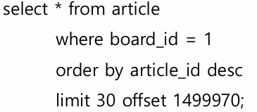

# week-04

## 0 질문 리스트

### OFFSET LIMIT 최적화 쿼리 ?

- 예시
    
    
    
- 최적화 쿼리
    
    ```sql
     select * from (
    	 select article_id from article
    	 where board_id = 1
    	 order by article_id desc
    	 limit 30 offset 1499970
     ) t left join article on t.article_id = article.article_id
    ```
    

### BTree Split 연산 ?

- 참고자료
    
    ### B트리
    
    - 정의 ) m원 탐색트리 (B+트리는 아님)
        - 루트는 최소 2개의 자식을 가짐
        - 다른 내부 노드는 최소 ceil(m/2) 개의 자식 / ceil(m/2) - 1 의 노드
        - 모든 외부노드는 레벨이 같다
        - 총 키값 개수 + 1 만큼 실패노드가 존재한다
    - 특징 ) 너무 작은m → 높이 때문에 성능이 나빠짐 / 너무 큰m → 노드 원소수 때문에 성능 나빠짐
    - 2-3트리 → m=3인 B트리 / 2-3-4 트리 → m=4인 B트리
    - 삽입 연산 → 자리 없으면 올리고 분할
        - 크기 비교해서 노드를 찾다가 찾은 노드에 자리가 없으면 중간값을 부모로 올리고 노드를 반으로 분할한다
        - 중간값은 ceil(m/2) 번째 노드임 (1번부터 시작)
        - 2-3트리 → 20 30 40 에 50 추가하면 → 30이 올라가고 20 → 30 ← 40 50
        - 올렸는데도 자리가 없으면 부모 노드에 똑같이 삽입 연산
    - 삭제 연산 → 모자라면 회전하거나 결합 (둘 다 가능할수도 있는데 기준 정하면됨)
        - 형제노드의 원소수가 적으면 회전이 안됨 → 결합해야됨
        - 회전은 부모노드에서 원소 가져오고 부모노드는 형제노드에서 원소를 가져온다
            - (60) → 80 ← 90 95 ⇒ 80 → 90 ← 95
        - 결합은 형제노드가 부모노드에서 원소 가져오고 부모노드가 삭제된 노드의 원소를 가져온다
            - (60) → 80 ← 90 ⇒  80 → 90
    - 2-3 트리 (차수가 3인 B트리)
    - 2-3-4 트리 (차수가 4인 B트리)
        - 하향식 삽입 → 루트에서부터 삽입할 위치를 찾을 때 4노드를 분할한다
            - 상향하면서 전부 연산하는 거 방비
        - 하향식 삭제 → 2노드를 미리 결합, 회전해서 재구성한다
    
    ### B+트리
    
    - 정의 ) 인덱스 노드와 데이터 노드로 나누어진다
        - 실패노드 위치에 데이터 노드가 삽입됨
        - 모든 데이터 노드의 레벨은 같다
        - 데이터 노드에 삽입된 원소는 작은 키값≤ 원소 < 큰 키값 이다
        - 데이터 노드 원소 개수는 ceil(c/2) 이상이다
        - 데이터 노드끼리는 서로 가리키는 이중 포인터가 있음
        - 인덱스 노드는 키값을 갖지만 원소는 없다
    - 삽입
        - 1 ) 가득차면 → 데이터 노드를 큰 쪽 절반을 나누고 큰 쪽에서 가장 작은 원소를 인덱스 노드 키로 올린다
        - 2 ) 인덱스 노드에서 B트리 삽입과 동일하게 키를 처리한다
    - 삭제
        - 1 ) 부족하면 → B트리랑 똑같이 회전 또는 결합한다
        - 2 ) 회전 → 인접 데이터 노드에서 빌려오고, 그 사이 키값을 변경
        - 3 ) 병합 → 인젭 데이터 노드에서 전부 가져오고, 그 사이 키값을 삭제
- 삽입, 삭제연산 ?

## 8.1 디스크 읽기 방식

- SSD의 장점
    - 순차 I/O는 하드 디스크와 비슷
    - 랜덤 I/O가 훨씬 빠르다
        - 이유 ) 순차 I/O는 페이지가 여러개여도 시스템 콜 1번만 한다
- 인덱스 레인지 스캔
    - 인덱스 레인지 스캔 → 랜덤 I/O 이용
    - 풀 테이블 스캔 → 순차 I/O 이용
    - 결론 ) 큰 테이블의 대부분 레코드를 읽을때 풀 테이블 스킨이 빠를 수 있음

## 8.2 인덱스란?

- 인덱스는 SortedList / 데이터는 ArrayList
- 인덱스 장점 ) SELECT가 빠르다. 나머지 CUD는 느림
- Primary key
    - 중복 안됨
    - Not NULL
- Secondary key
    - PK를 제외한 모든 세컨더리 인덱스
- 종류
    - B Tree Index
    - Hash Index
    - Fractal Tree Index
    - Merge Tree Index

## 8.3 B-Tree Index

### B Tree

- Branch Node + Leaf Node
- Leaf Node
    - 실제 데이터 레코드 주소값 저장
    - Insert된 순서는 아니고, 랜덤이라 봐야됨 (삭제된 자리에 Insert 한다)
- InnoDB B-Tree
    - Secondary Index
        - Branch Node (인덱스 키, 자식노드 주소)
        - Leaf Node (인덱스 키, PK)
    - Primary Index
        - Branch Node (인덱스 키, 자식노드 주소)
        - Leaf Node (PK, 모든 Rocord 정보)
- 8.0이전 버전인 MyISAM 테이블은 Secondary Index 트리 Leaf Node에 데이터 노드의 물리주소 저장
- B-Tree 추가
    - 쓰기는 노드가 가득차면 Split 연산이 추가로 필요
    - 테이블 레코드 추가 비용이 1이면, 인덱스 키 추가 비용은 1.5 정도
- B-Tree 삭제
    - 삭제 마킹이 필요 → Update와 비슷

### Key 검색 - 왼쪽 값 기준 규칙

- 앞부분 검색 / 부등호 / 일치 검색 → 탐색 가능
    - Left Most 정렬 인덱스의 효과를 봄
- 뒷부분 검색 / 함수나 연산 결과로 정렬→ 불가능
    - Left Most 정렬 인덱스를 사용 불가

### 인덱스 키 크기와 성능

- 트리 노드는 인덱스 페이지 1개로 구성되어 있다
- 인덱스 페이지의 엔트리 (인덱스 키, 자식노드 주소) 크기가 커지면 저장가능한 엔트리 개수가 줄어든다
- 결과적으로 트리 높이가 커져서 탐색 시간이 증가
- 결론 ) 키 값의 크기는 작을 수록 좋다

### 중복 값과 성능

- 같은 개수 레코드라도, 중복값이 적다 → Cardinarity가 크다 → 성능이 좋다
    - Cardinarity 는 중복 제거하고 몇 종류의 레코드가 있는지
- 인덱스로 찾는 경우 순차 탐색보다 4~5배 비용이 든다
    - 한번에 읽어올 때 전체의 20~25% 정도 까지는 인덱스로 읽는게 유리, 그 이상은 전체 테이블을 읽는게 유리

### 레인지 스캔

- 리프노드는 다음 리프노드를 가리키는 주소를 가지고 있음
- 범위 스캔을 할 때, 시작위치부터 리프노드에서만 탐색해서 긁어오면 된다
- 레코드 주소를 찾았으면, 1개씩 랜덤 I/O로 데이터를 탐색한다
- 정리 ) 인덱스 탐색 → 인덱스 스캔 → 최종 레코드 읽기
    - 탐색 : 트리 탐색
    - 스캔 : 리프노드 순차탐색
- 탐색 비용 확인 명령어
    - SHOW STATUS LIKE ‘Handler_%’ ;
        - Handler_read_first → 인덱스 첫번째 레코드 읽은 횟수
        - Handler_read_key → 인덱스 탐색 횟수
        - Handler_read_next → 인덱스 스캔 횟수
- 인덱스 풀 스캔
    - 첫번째 리프노드의 첫번째 엔트리부터 Linked List를 따라서 끝까지 읽는다
- 스캔 방법 확인하는 명령어
    - EXPLAIN SELECT ~
    - 결과값의 type 값이 RANGE→ 범위 스캔
        - type 값이 INDEX → 풀 인덱스 스캔
        - type 값이 ALL → 풀 테이블 스캔

### Loose 인덱스 스캔 = Index Skip Scan

- Tight 인덱스 스캔과 반댓말
- 불필요한부분 스킵해서 스캔
- 설정
    - SET optimizer_switch=’skip_scan=on’
- 코드
    
    ```sql
    // 인덱스 생성
    ALTER TABLE employees
    	ADD INDEX idx_gender_birthdate(gender, birth_date);
    
    // 인덱스 사용하려면 gender와 birth_date를 둘 다 명시하거나
    // gender를 명시해야됨
    // 만약 birth_date만 명시하면 인덱싱이 불가능하고, skip scan으로 최적화가 필요
    SELECT * FROM employees WHERE birth_date>='2020-02-02';
    
    // skip scan 최적화 쿼리
    SELECT gender, birth_date FROM employees WHERE gender='M' AND birth_date>='2020-02-02';
    SELECT gender, birth_date FROM employees WHERE gender='F' AND birth_date>='2020-02-02';
    ```
    
    - Skip Scan 조건
        - 이전 컬럼(gender)의 도메인이 작아야됨 (ex - enum)
        - Covering Index 여야됨
    - 이전 컬럼 도메인이 크다면 검색이 오래걸려서 성능 떨어짐

### 오름차순 내림차순

- 일반적으로 오름차순으로 저장하고
- 내림차순으로 조회한다면 역순으로 읽어서 내림차순을 구현
- 속도 ) 오름차순 인덱스 → 내림차순 조회 < 오름차순 인덱스 → 오름차순 조회
    - 역순으로 읽더라도 정렬 순으로 읽는 것 보다 느리다
    - 이유 ) 인덱스 레코드가 단방향 연결이다
- 결론 ) 되도록이면 인덱스 생성과 조회의 차순을 동일하게 하자
    - 내림차순 인덱스 → 내림차순 조회
    - 오른차순 인덱스 → 오름차순 조회

### 작업 범위 결정 조건 vs 필터링 조건

- 부등호는 작업 범위 결정 조건
    - dept_no ≥ 001
- 등호는 필터링 조건
    - dept_no = 001
- 작업 범위 조건의 경우 범위 스캔시 시간 단축에 도움이됨
    - 필터링 조건은 시간 단축에 도움이 안됨
    - 작업 범위 조건은 조건이 만족했을때 이후 모든 레코드가 조건을 만족하므로 레코드 스캔시 점프가 가능하다
    - 필터링 조건은 점프없이 모든 값을 비교연산 해야한다
- 필터링 조건 종류
    
    ```sql
    // Not Equal
    <> 'A' // !=
    NOT IN (1, 2, 3)
    IS NOT NULL
    
    // 뒷부분
    LIKE '%A'
    LIKE '_A'
    LIKE '%A%'
    
    // 함수사용
    SUBSTRING(col, 1, 1) = 'A'
    DAYOFMONTH(col) = 1
    
    // 형변환
    char_col = 10
    
    ```
    
- NULL
    - NULL값도 인덱스에 저장된다 → 인덱스 탐색 가능
- 작업 범위 조건 종류
    
    ```sql
    INDEX idx(col1, col2, col3)
    
    col1=1 AND col2>10
    col1 IN(1,2) AND col2=2 AND col3<=10
    col1=1 AND col2 LIKE 'A%'
    ```
    

## RTree 인덱스

- 2차원 도형을 DB 도메인으로 받을 수 있다
- 2차원 도형을 MBR 형태로 감싸서
    - 포함관계를 찾아 트리형태로 BTree를 구현
    - 마지막 리프 노드에 2차원 도형 데이터 저장
- 활용 ) 반경 5KM내에 있는 위치 검색