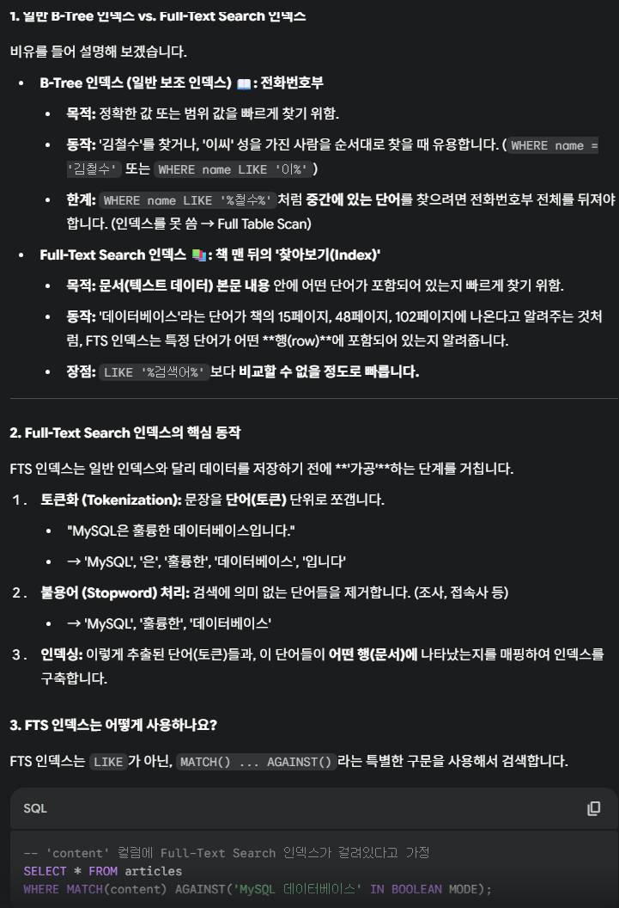
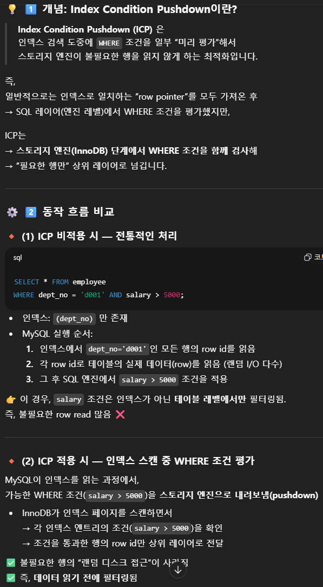

# week-08

# 질문

### SKIP_SCAN의 성능이 떨어지는 경우

- 쿼리
    
    ```sql
    select col1, col2 from t1
    	where col2 >= 1
    # t1(col1, col2) 인덱스 존재
    # col1의 unique 값 개수가 많으면 성능이 떨어진다
    ```
    
    - Cardinality : 유니크한 값의 개수
    - Selectivity 선택도 : 유니크한 값 개수 / 총 개수

### row개수를 샐때 `SQL_CALC_FOUND_ROWS` 를 사용하는 것보다 count(*)이 빠른이유

- `SQL_CALC_FOUND_ROWS` 는 limit을 걸어도 물리 테이블에서 모든 row를 읽어서 Random I/O가 많다
- count(*)은 인덱싱으로 값이 존재하는지만 확인하기 때문에 Random I/O 가 적다

### 옵티마이저가 Nested Loop 조인과 해시조인을 선택하는 기준

- 드리븐 테이블 (외부→내부)에 인덱스가 존재하면 Nested Loop를 선택
- 조인키 인덱스가 없으면 해시 조인을 선

# 정리

## 조인 최적화 알고리즘

### Exhaustive 검색 알고리즘

- From 절의 모든 테이블을 합치는데 순서를 고려
- 순열개수 n! 만큼 확인하고 최적 조합 1개만 고름

### Greedy 검색 알고리즘

- 1234테이블 있고 search_depth값이 2라고 가정
    - 우선 전체에서 nP2 조합중에서 가장 빠른거를 고른다 (t3→t2)
    - t3를 제외하고 나머지 n-1P2 조합중에서 가장 빠른거를 고른다 (t4→t2)
    - 마찬가지로 t3, t4 제외하고 나머지 n-2P2 중에서 가장 빠른거를 고른다 (t2→t1)
    - 결과적으로 t3 → t4 → t2 → t1 순서
- `optimizer_search_depth` 시스템 변수
    - 기본값 62
    - search_depth 보다 조인 테이블 개수가 작으면 Exhaustive 사용
    - 값이 0이면 Greedy search_depth를 자동으로 결정
    - 평균적으로 search_depth가 커지면 매 단계마다 조합개수도 커져서 시간도 오래 걸리는 듯 하다
- `optimizer_prune_level`
    - 1 : 휴리스틱 검색을 통해 비용이 최솟값보다 커지면 그 방법은 가지치기 → 시간 절약
    - 0 : 가지치기를 안한다 (비추천)

## 쿼리 힌트

- 인덱스 힌트보다 나중에 추가된 옵티마이저 힌트는 ANSI-SQL 표준을 준수 (다른 DBMS에서 주석으로 처리된다)
- 되도록 인덱스 힌트 < 옵티마이저 힌트 사용

## 옵티마이저 힌트

### STRAIGHT_JOIN

- 강제로 드라이빙 테이블 지정
    
    ```sql
    select straight_join col1, col2
    	from t1, t2 #t1 -> t2 순서로 조인
    
    // 같은 코드 
    select /*! straight_join */ col1, col2
    	from t1, t2 #t1 -> t2 순서로 조인
    ```
    
- 임시 테이블 끼리 조인 하는 경우
    - 인덱스가 없기 때문에 크기가 작은 테이블(where 결과)을 드라이빙으로
- 한 쪽에만 인덱스가 없는 경우
    - 인덱스가 없는 테이블을 드라이빙으로

### 🧩 2️⃣ 문법 형식

MySQL 5.7.7 이후부터 표준 형식은 다음과 같습니다:

```sql
SELECT /*+ HINT_NAME(param, ...) */ ...
FROM ...
```

📌 즉, `/*+` 와 `*/` 사이에 옵티마이저 힌트를 넣습니다.

일반 주석처럼 보이지만 실제로는 옵티마이저가 인식합니다.

---

### STRAIGHT_JOIN과 차이점

- 힌트는 옵티마이저가 선택적으로 무시할 수 있음
- STRAIGHT_JOIN은 반드시 선택됨

### 🧠 3️⃣ 힌트 종류별 예시

① **조인 순서 제어**

```sql
SELECT /*+ JOIN_ORDER(e, s) */ *
FROM employee e
JOIN salaries s ON s.emp_no = e.emp_no;
```

👉 옵티마이저에게 “employee → salaries 순서로 조인하라”고 강제

---

② **드라이빙 테이블 고정**

```sql
SELECT /*+ LEADING(e) */ *
FROM employee e
JOIN salaries s ON s.emp_no = e.emp_no;
```

👉 `employee`를 드라이빙 테이블로 강제

---

③ **특정 인덱스 사용**

```sql
SELECT /*+ INDEX(e idx_firstname) */ *
FROM employee e
WHERE e.first_name='Matt';
```

👉 옵티마이저가 `idx_firstname` 인덱스를 반드시 사용하도록 지시

---

④ **특정 최적화 비활성화**

```sql
SELECT /*+ NO_ICP(e) */ *
FROM employee e
WHERE e.hire_date BETWEEN '1990-01-01' AND '1999-12-31';
```

👉 ICP (Index Condition Pushdown) 최적화를 사용하지 않게 함

---

⑤ **서브쿼리 최적화 제어**

```sql
SELECT *
FROM employee e
WHERE e.emp_no IN (
	SELECT /*+ SEMIJOIN(MATERIALIZATION) */ s.emp_no 
	FROM salaries s);
	
# 외부 쿼리에 사용할 때는 이렇게
SELECT /*+ SEMIJOIN(@sub MATERIALIZATION) */ *
FROM employee e
WHERE e.emp_no IN (
	SELECT /*+ QB_NAME(sub) */ s.emp_no 
	FROM salaries s);
	
# 최적화 사용 안할때
SELECT *
FROM employee e
WHERE e.emp_no IN ( 
	SELECT /*+ NO_SEMIJOIN(DUPSWEEDOUT, FIRSTMATCH) */ s.emp_no 
	FROM salaries s);
```

👉 `IN (subquery)` 최적화 전략 중 `Duplicate Weed-out` 방식을 지정

(`SEMIJOIN`, `MATERIALIZATION`, `LOOSESAN`, `FIRSTMATCH` 등의 방식 선택 가능)

- Table Pull-out 방식은 항상 최적화가 더 좋기 때문에 선택이 아니라 강제임
- 외부 쿼리가 아니라 서브 쿼리에 지정해야됨

---

⑥ **조인 알고리즘 선택**

```sql
SELECT /*+ BNL(s) */ *
FROM employee e
JOIN salaries s ON s.emp_no = e.emp_no;
```

👉 조인 시 **Block Nested Loop Join** 사용 강제

(`BNL`, `BKA`, `HASH_JOIN` 등 가능)

7 서브쿼리의 조인 최적화시 조인 순서 지정

```sql
select /*+ join_order(t, s@sub) */
	count(*) from t1 t
	where ~ and col in(
		select /*+ QB_NAME(sub) */
			col1 from t2 s
	)
# QB_NAME으로 쿼리블록의 이름을 지정하고
# join_order로 아우터 쿼리 블록과 조인 순서를 지정
# 세미 조인 최적화를 할 것이 예상되어야함
```

### 인덱스 힌트

- 인덱스 지정이 가능하나 강제는 아님
- 쿼리
    
    ```sql
    # 인덱스 사용 추천 -> 전혀 관련없는 인덱스를 지정하면 풀테이블 스캔# 인덱스 사용 추천 -> 전혀 관련없는 인덱스를 지정하면 풀테이블 스캔
    select * from employees use index(primary) where a=1; 
    # order by에만 사용
    select * from employees use index(primary) for order by where a=1;
    # 인덱스 사용 안함 -> 풀테이블 조인을 유도할때 사용
    select * from employees ignore index(primary) where a=1; 
    
    ```
    
- Full Text Search 인덱스 > B-Tree 인덱스
    
    
    

### `SQL_CALC_FOUND_ROWS`

- Limit으로 random io 횟수 제한은 걸어도 조건을 만족하는 모든 row를 random io 해서 개수를 구하는 설정
- 이 설정보다 count(*)이 효율적이다 (인덱스가 있는 경우)
- 쿼리
    
    ```sql
    // random io가 20번이 아닌 c=1인 모든 row에 대해서 발생
    // (개수만 찾는게 아니라 모든 컬럼을 조회하는 듯함)
    select sql_calc_found_rows * from t where c=1 limit 0, 20;
    select found_rows() as total_record_count; // c=1인 개수 반환
    
    // indexing이 되어 있으므로 random io 가 아니라 인덱싱 이용 -> 훨씬 빠르다
    select count(*) from t where c=1;
    select * from t where c=1 limit 0, 20;
    ```
    

### MAX_EXECUTE_TIME

- 실행 계획과 무관
- 단순히 쿼리 최대 실행 시간 설정
    
    ```sql
    # 100 밀리초 넘어가면 쿼리 실패
    select /*+ max_execution_time(100) */ from ~ 
    ```
    

### SET_VAR

- 일시적으로 시스템 변수 제어
    
    ```sql
    # 조인 버퍼를 사용
    select /*+ set_var(optimizer_switch='index_merge_intersection=off') */
    ```
    

### BNL & NO_BNL

- 8.0.20버전부터는 BNL대신 해시조인 사용
- `/*+ BNL(e, sub) */` 의 용도가 BNL을 하는 것에서 해시조인으로 바뀌었다
- 마찬가지로 `/*+ NO_BNL(e, sub) */` 하면 해시조인을 하지 않는다
- 그러나 해시조인은 조인조건 컬럼의 인덱스가 없을때만 사용하고,
    - 인덱스가 있다면 Nested Loop 조인을 사용 할 것이다

### JOIN_ORDER & JOIN_PREFIX

- `join_fixed_order()` → from 절 나열된 테이블 순서로 조인
- `join_order(a, b`) → 지정된 테이블 순서로 조인
- `join_prefix(a, b)` → 드라이빙 테이블에 대해서만 조인 순서 지정
- `join_suffix(a, b)` → 드리븐 테이블에 대해서만 조인 순서 지정

### MERGE & NO_MERGE

- Derived 머지를 이용하면 Derived Table을 임시테이블로 만들지 않는다
    - 서브쿼리를 풀어서 하나의 쿼리로 표현 가능해야됨
- 옵티마이저가 Derived 머지가 가능한지 판단하기 어려운데, 명시적으로 지정이 가능
    - `/*+ MERGE(sub) */`
        - 서브쿼리 alias가 sub일 경우
        - 명시적 Derived 머지 지정
    - `/*+ NO_MERGE(sub) */`
        - 명시적 Derived 머지 안하고 임시테이블 생성

### INDEX_MERGE & NO_INDEX_MERGE

- 인덱스 머지는 하나의 인덱스만 사용하는게 아니고
- 테이블당 여러개 인덱스를 사용해 각각 결과를 뽑아내고, 결과의 교집합으로 최종 결과를 반환
- 성능 향상에 도움이 될 수도 있고, 아닐수도 있어서 옵티마이저 힌트로 지정이 가능
- `/*+ INDEX_MERGE(employees ix_firstname, PRIMARY) */`
- `/*+ NO_INDEX_MERGE(employees PRIMARY) */`

### NO_ICP

- ICP : Index Condition Pushdown
    - 사용가능하면 항상 성능이 오른다
    - 그래서 보통 ICP를 사용하는 인덱스를 선택한다
- 그러나 ICP를 사용하지 않는 다른 인덱스가 더 효율적이라면, 선호를 해제할 필요가 있다
- 해제하는 힌트만 존재
    - `/*+ NO_ICP(employees ix_lastname_firstname) */`
- ICP → where 조건이 2개이고 첫번째 조건만 인덱싱 되어있으면
    - 두번째 조건은 랜덤 io로 디스크 접근하는데, 원래는 전부 읽어서 불러와야되지만
    - ICP으로 조건을 InnoDB(스토리지엔진)으로 같이 주면, 디스크가 조건에 해당하는 데이터만 읽어옴 (랜덤 IO 감소)
    
    
    

### SKIP_SCAN & NO_SKIP_SCAN

- 선행 조건의 유니크한 범위가 적을 때 효율적
    - 유니크한 값이 많으면 성능이 떨어지기 때문에 해제할 수 있다
- 쿼리
    
    ```sql
    select col1, col2 from t1
    	where col2 >= 1
    # t1(col1, col2) 인덱스 존재
    # col1의 unique 값 개수가 많으면 성능이 떨어진다
    
    # SKip Scan 해제
    select /*+ NO_SKIP_SCAN(t1 idx_col1_col2) */ col1, col2 from t1
    	where col2 >= 1
    ```
    

### INDEX &  NO_INDEX

- 예전에 쓰던 인덱스 힌트를 옵티마이저 힌트처럼 쓸 수 있음

```sql
select * from t1 use index(idx_col1);

select /*+ index(t1 idx_col1) */ * from t1;
```